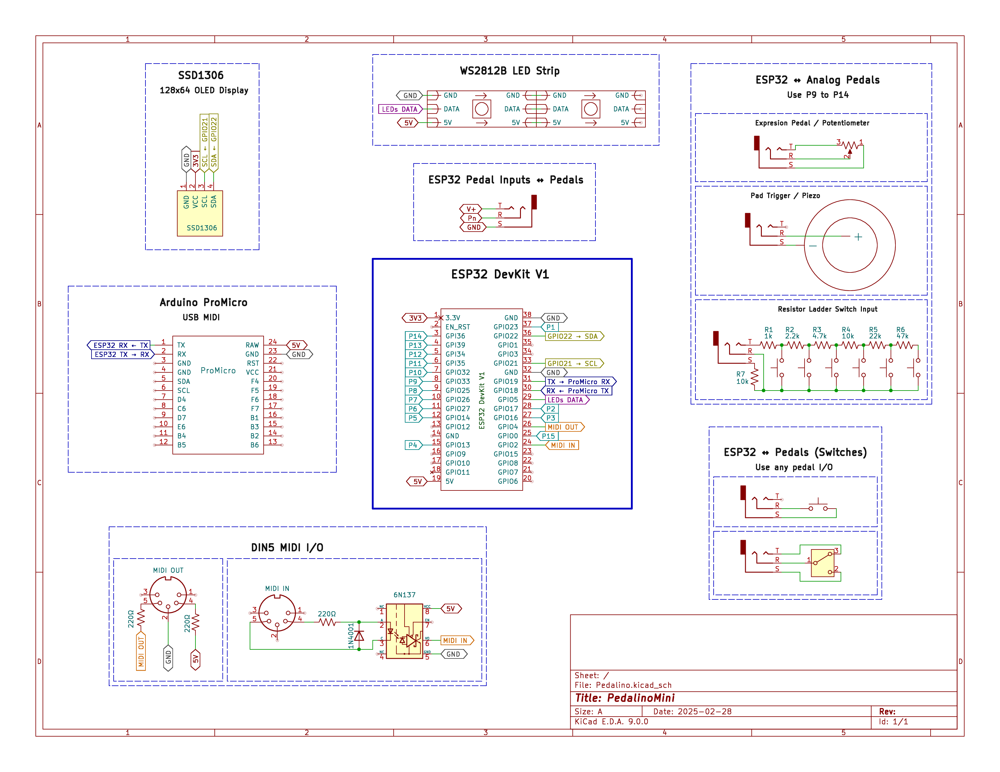
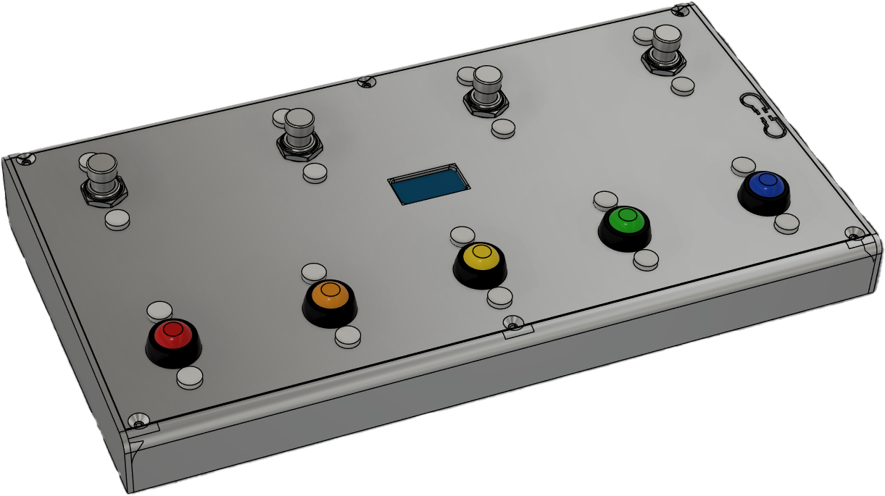

  

# PedalinoMini Phoenix 🐦‍🔥: A Modern Reborn MIDI Controller

PedalinoMini Phoenix is a significant evolution of the original **[PedalinoMini™](https://github.com/alf45tar/PedalinoMini)**, bringing modern features, improved usability, and enhanced performance to this wireless MIDI foot controller for musicians.

## ✨ Key Improvements

- **Expanded Connectivity**: Supports up to 15 inputs, allowing a flexible combination of footswitches and expression pedals.
- **Enhanced UI**: Dark mode enabled by default with a Phoenix-themed color scheme featuring orange highlights.
- **Improved Profile System**: Easily switch between profiles with color-coded LED indicators.
- **Better User Experience**: Redesigned homepage with a card-based layout displaying system status at a glance.
- **Simplified Setup**: Preconfigured credentials and default settings make initial setup quick and easy.
- **Visual Enhancements**: New LED effects and animations provide clear system status feedback.
- **Optimized Display Performance**: Fixed SSD1306 OLED display glitches on ESP32 through advanced multi-core task scheduling and cooperative yielding between display and MIDI operations.
- **Comprehensive Documentation**: Organized and accessible docs using mkdocs.

> This refresh retains the core functionality that made the original PedalinoMini popular while adding modern touches and quality-of-life improvements for performers.

### ⚠️ Important Changes & Limitations

- **Board Support**: Optimized for **ESP32 DevKit V1**. Other ESP32 boards may work but are not officially tested.
- **USB MIDI**: Officially tested with **Arduino ProMicro**. Other implementations may work but aren't guaranteed.
- **Removed Features**: Pedal types requiring 2 GPIO pins (e.g., rotary encoders, ultrasonic sensors) have been removed to enable the new 15-pedal mode, where each pedal uses a single GPIO.
- **Simplified Input Types**: Focused on the most common types: momentary switches, latches, analog pedals, and analog pads.

---

## 🚀 Getting Started  

    <tr>
      <td align="center" style="padding-right: 20px; width: 200px;">
        
      </td>
      <td>
        
<em>Quickly upload the firmware and configure your device.</em>

      </td>
    </tr>
    <tr>
      <td align="center" style="padding-right: 20px; width: 200px;">
        
      </td>
      <td>
        
<em>Learn everything about setup, features, and more.</em>

      </td>
    </tr>

---

## 💸 Bill of Materials

- **ESP32 board:** Any ESP32 board supported by [Arduino core for ESP32](https://github.com/espressif/arduino-esp32)
  - Tested on [DOIT ESP32 DevKit V1](https://github.com/SmartArduino/SZDOITWiKi/wiki/ESP8266---ESP32) 4M dual-mode Wi-Fi and Bluetooth module
- **OLED I2C display:** 0.96" or 1.3", 128x64, SSD1306/SH1106
- **USB MIDI hardware:**
  - Arduino ProMicro
- **DIN MIDI hardware:**
  - **MIDI OUT**: DIN5 connector, 2x 220 Ohm resistors
  - **MIDI IN**: DIN5 connector, 2x 220 Ohm resistors, 1N4001 diode, 6N137 optocoupler

## ⚡ Schematic

[View Full Schematic](./docs/assets/Schematic_PedalinoMini.webp)

## 🔌 Pin Configuration Guide

### Pedal Assignments
| Pedal  | GPIO  | Digital |  Analog  | Type                     |
|--------|-------|---------|----------|--------------------------|
| 1      | 23    | ✅      | ❌      | Digital Switch           |
| 2      | 17    | ✅      | ❌      | Digital Switch           |
| 3      | 16    | ✅      | ❌      | Digital Switch           |
| 4      | 13    | ✅      | ❌      | Digital Switch           |
| 5      | 14    | ✅      | ❌      | Digital Switch           |
| 6      | 27    | ✅      | ❌      | Digital Switch           |
| 7      | 26    | ✅      | ❌      | Digital Switch           |
| 8      | 25    | ✅      | ❌      | Digital Switch           |
| 9      | 33    | ✅      | ✅      | Expression (ADC)         |
| 10     | 32    | ✅      | ✅      | Expression (ADC)         |
| 11     | 35    | ✅      | ✅      | Expression (ADC)         |
| 12     | 34    | ✅      | ✅      | Expression (ADC)         |
| 13     | 39    | ✅      | ✅      | Expression (ADC)         |
| 14     | 36    | ✅      | ✅      | Expression (ADC)         |
| 15     | 0     | ✅      | ❌      | Digital Switch (Onboard) |

### System Pins
- **MIDI IN**: GPIO 2
- **MIDI OUT**: GPIO 4
- **USB MIDI**: GPIO 18, 19
- **LED Strip**: GPIO 5
- **OLED SDA**: GPIO 22
- **OLED SCL**: GPIO 21

See the documentation for a complete list of pin assignments and wiring details.

## Build

Coming Sooon

## ⚖️ License

This project is licensed under the [GPL-3.0 License](LICENSE).