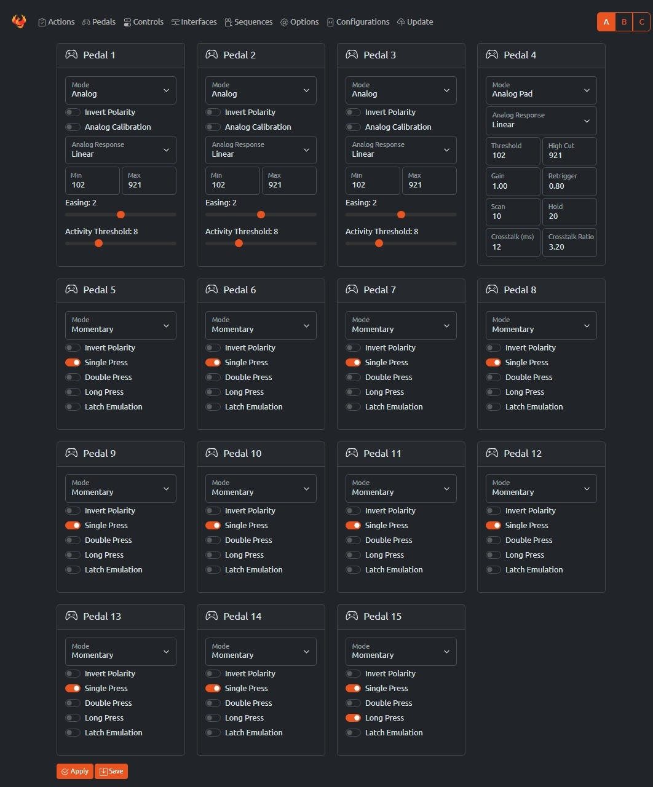

## Pedals

Once PedalinoMini is connected to a WiFI network and you are connected to the web user interface it is time to configure which pedal is connected to each of the 15 available ports. Pedal 15 is the on board buttons and is fully configurable.

| | Description |
|:-----------|:----------- |
| Mode | Select one of the following: NONE, MOMENTARY, LATCH, ANALOG, LADDER, TRIGGER. |
| Invert Polarity | Normally open (NO) and normally closed (NC) momentary switches are supported and configurable by software if the foot switch do not have a polarity switch. On analog pedal or ultrasonic ranging sensor it invert the range. |
| Singles Press | Select Enable/Disable here to enable/disable PRESS, RELEASE and CLICK events. CLICK event is detected after a PRESS followed by a RELEASE event on momentary switches and on PRESS and on RELEASE on latch switches. |
| Double Press | Select Enable/Disable here to enable/disable DOUBLE CLICK events. If double press is enabled CLICK event is postponed until double press timeout (by default 400ms). |
| Long Press | Select Enable/Disable here to enable/disable LONG PRESS, REPEAT PRESSED and LONG RELEASE events. LONG PRESS event is detected after a PRESS event with no RELEASE event within the long press timeout (by default 500ms). After a LONG PRESS event a REPEAT PRESSED event is triggered every repeat press timeout (by default 1000ms) until the button is keep pressed. After a LONG PRESS event the RELEASE event is replaced by a LONG RELEASE event. Two sequences of events are possible: PRESS and RELEASE or PRESS, LONG PRESS, REPEAT PRESS (optional) and LONG RELEASE. |
| Analog Calibration | Enable analog pedal continuous calibration. Min and Max values are managed by PedalinoMini. After each power on cycle move the expression pedals to its full range and PedalinoMini will calibrate it. During the first full movement of the pedal MIDI events could be not precise because PedalinoMini is still learning the full range of the pedal. |
| Analog Response | Mapping between analog pedal movement and response. Accepted values: LINEAR (as is response), LOG (great acceleration but than flat), ANTILOG (start slow with a rapid increase). |
| Min | In ANALOG mode minumum digital value (after analog-to-digital conversion) that can reach the connected expression pedal. In ULTRASONIC mode the minimum distance (250 is around 2cm and it is not recommended to go below). Acceptable values are from 0 to 1023 |
| Max | In ANALOG mode maximum digital value (after analog-to-digital conversion) that can reach the connected expression pedal. In ULTRASONIC mode the maximum distance (1023 is around 18cm and it is far enough for the application). Acceptable values are from 0 to 1023. |
| Easing | It controls the amount of easing. Possible values are: 1, 2 or 3. Bigger value makes the responsive values more responsive: output value follows immediately the input value. Recommended values: 1 for ultrasonic sensor, 2 or 3 for potentiometer. |
| Activity Threshold | The amount of movement that must take place for it to register as activity and start moving the output value. Increase the value to suppress noisy potentiometer. Recommended values: 8 or 16 for potentiometer, 64 for ultrasonic sensor. |